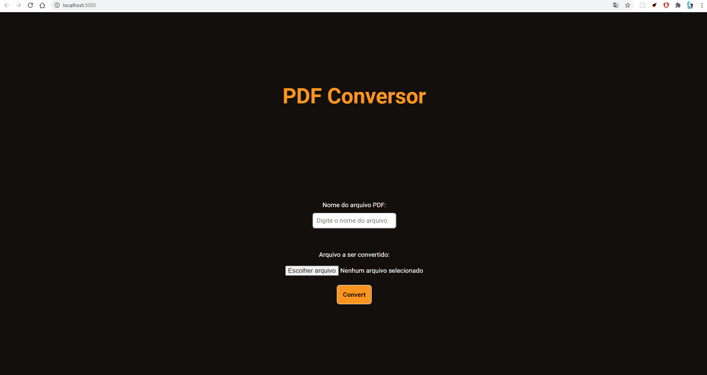

# PDF conversor

A idéia é fazer um conversor totalmente com código aberto, para quem for usa-lo ter como ter certeza que não está tendo as fotos do cachorro, documentos, armazenados em algum lugar para venda de informações (sim esse é um medo que eu tive hahaha), por isso quis criar esse carinha aqui open-source.

[](https://github.com/ellerbrock/open-source-badges/)

## Usage



Para utilizar o PDF conversor:

```
  git clone <endereço do repositório>
  npm install ou yarn
  npm lite-server
  npm dev
```

Isso abrirá o navegador com a pagina do PDF conversor pronto para receber arquivos para conversão

## Mecânica de exclusão

Após o download do arquivo PDF recém convertido o arquivo original e o PDF que foi usado para download serão excluídos, visando entregar o esperado para o usuário e apagar suas informações em seguida. 

## Disclaimer

Side-Projeto feito com objetivo de mexer tratamento de arquivos, criar uma ferramenta que não roubará seus dados e coloca-lá online 4fun

[](http://cv.lbesson.qc.to/)